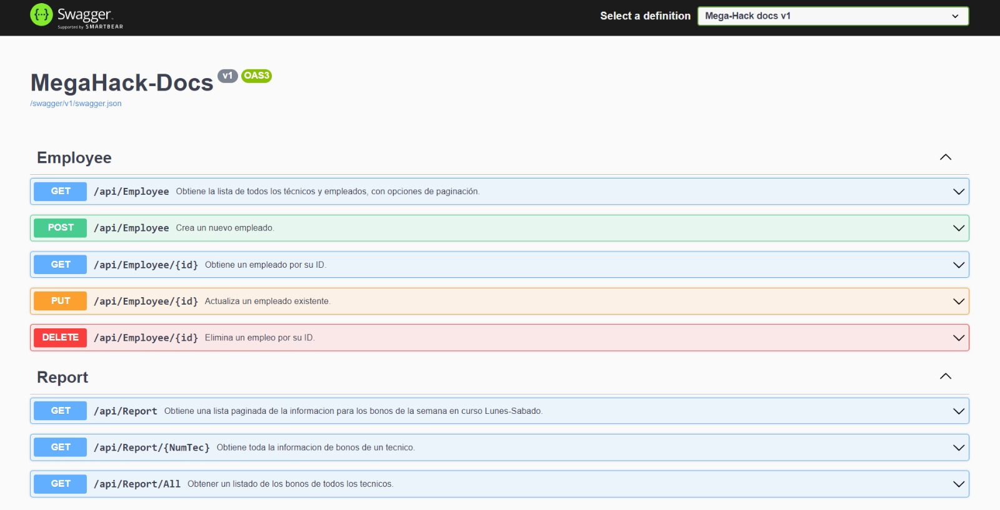
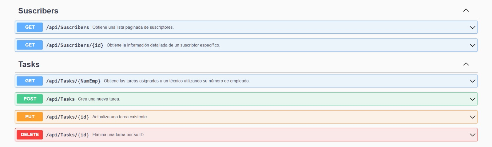

# Documentación API

## Rutas

### Empleado

- **[GET] /api/Employee**
  - **Descripción**: Obtiene una lista paginada de todos los técnicos y empleados registrados en el sistema.
  - **Parámetros de Consulta**:
    - `pageNumber`: (opcional) Número de la página a recuperar.
    - `pageSize`: (opcional) Número de técnicos/empleados por página.
    - `SortBy`: Campo por el que se deben ordenar los resultados. Por ejemplo, name, date.
  - **Respuesta**:
    - Código 200: Retorna un objeto JSON con la lista de técnicos/empleados y la información de paginación.
    - Código 404: No se encontraron técnicos/empleados.

- **[POST] /api/Employee**
  - **Descripción**: Crea un nuevo empleado/técnico.
  - **Request Body**:
    - Objeto JSON con los siguientes campos:
      -`quadrille_id`: Identificador de la cuadrilla del técnico.
      -`name`: Nombre del técnico/empleado.
      -`last_name`: Apellido del técnico/empleado.
      -`phone`: Número de teléfono del técnico/empleado.
      -`employee_number`: Número identificador del técnico/empleado.

  - **Respuesta**:
    - Código 200: Retorna un objeto JSON con la información del empleado creado. Mensaje: "Empleado creado exitosamente"

- **[GET] /api/Employee/{id}**
  - **Descripción**: Obtiene la información detallada de un técnico específico utilizando su ID.
  - **Parámetros**:
    - `id`: Identificador único del técnico.
  - **Respuesta**:
    - Código 200: Retorna un objeto JSON con los detalles del técnico.
    - Código 404: Empleado no encontrado.

- **[PUT] /api/Employee/{id}**
  - **Descripción**: Actualiza un empleado/técnico existente.
  - **Parámetros**:
    - `id`: Identificador único del empleado a actualizar.
  - **Request Body**:
    - Objeto JSON con los siguientes campos:
      -`quadrille_id`: Identificador de la cuadrilla del técnico.
      -`name`: Nombre del técnico/empleado.
      -`last_name`: Apellido del técnico/empleado.
      -`phone`: Número de teléfono del técnico/empleado.
  - **Respuesta**:
    - Código 200: Empleado actualizado con éxito.
    - Código 404: Empleado no encontrado.


- **[DELETE] /api/Employee/{id}**
  - **Descripción**: Elimina un empleado/técnico existente utilizando su id.
  - **Parámetros**:
    - `id`: Identificador único del empleado a eliminar.
  - **Respuesta**:
    - Código 200: Success. Mensaje: "Empleado eliminado con éxito.
    - Código 404: Empleado no encontrado.


### Reporte

- **[GET] /api/Report**
  - **Descripción**: Obtiene una lista paginada de la información para los bonos de la semana en curso de Lunes a Sábado.
  - **Parámetros de Consulta**:
    - `pageNumber`: Número de la página a recuperar.
    - `pageSize`: Número de técnicos/empleados por página.
    - `SortBy`: (opcional)Campo por el que se deben ordenar los resultados. Por ejemplo, name, date.
  - **Respuesta**:
    - Código 200: Retorna un objeto JSON con la información de los técnicos,  sus tareas y bonos para la semana en curso.

- **[GET] /api/Report/{NumTec}**
  - **Descripción**: Obtiene toda la información de bonos de un técnico.
  - **Parámetros de Consulta**:
    - `NumTec`: Número identificar del técnico a buscar.
  - **Respuesta**:
    - Código 200: Retorna un objeto JSON con la información del técnico, sus tareas y bonos para la semana en curso.
    - Código 404: Empleado no encontrado.


- **[GET] /api/Report/All**
  - **Descripción**: Obtiene el listado de los bonos de todos los técnicos.
  - **Respuesta**:
    - Código 200: Retorna un objeto JSON con la información de los técnicos, sus tareas y bonos.

### Suscriptores

- **[GET] /api/Suscribers**
  - **Descripción**: Obtiene una lista paginada de suscriptores registrados en el sistema.
  - **Parámetros de Consulta**:
    - `page`: Número de la página a recuperar.
    - `pageSize`: Número de suscriptores por página.
    - `SortBy`: (optional) Campo por el que se deben ordenar los resultados. Por ejemplo, name, date.
  - **Respuesta**:
    - Código 200: Retorna un objeto JSON con la lista de suscriptores y la información de paginación.

- **[GET] /api/Suscribers/{id}**
  - **Descripción**: Obtiene la información detallada de un suscriptor específico utilizando su ID.
  - **Parámetros**:
    - `id`: Identificador único del suscriptor.
  - **Respuesta**:
    - Código 200: Retorna un objeto JSON con los detalles del suscriptor.
    - Código 404: Suscriptor no encontrado.

### Tareas

- **[GET] /api/Tasks**
  - **Descripción**: Obtiene todas las tareas realizadas, permitiendo a los administradores revisar el historial de trabajo de los técnicos.
  - **Parámetros de Consulta**:
    - `filter`: (opcional) Parámetro para filtrar tareas por estado (completadas, pendientes, etc.).
    - `startDate`: (opcional) Fecha de inicio para filtrar tareas.
    - `endDate`: (opcional) Fecha de finalización para filtrar tareas.
  - **Respuesta**:
    - Código 200: Retorna un objeto JSON con la lista de tareas y detalles como tipo de trabajo, puntos, y estado.
    - Código 204: No se encontraron tareas.

- **[PUT] /api/Tasks/{id}**
  - **Descripción**: Actualiza una tarea existente.
  - **Parámetros**:
    - `id`: Identificador único de la tarea a actualizar.
  - **Request Body**:
    - Objeto JSON con los siguientes campos:
      -`technician_id`: Identificador del técnico.
      -`subscriber_id`: Identificador del suscriptor.
      -`service_id `: Identificador del servicio a realizar por el técnico.
      - `status`: Estado de la tarea.
  - **Respuesta**:
    - Código 200: Tarea actualizada exitosamente. Retorna un objeto JSON con los detalles de la tarea actualizada.
    - Códido 400: Error al actualizar la tarea.
    - Código 404: Tarea no encontrada.

- **[GET] /api/Tasks/{id}**
  - **Descripción**: Obtiene una tarea específica utilizando su ID.
  - **Parámetros**:
    - `id`: Identificador único de la tarea.
  - **Respuesta**:
    - Código 200: Retorna un objeto JSON con los detalles de la tarea.
    - Código 400: Error al actualizar la tarea.
    - Código 404: Tarea no encontrada.

- **[POST] /api/Task**
  - **Descripción**: Crea una nueva tarea.
  - **Request Body**:
    - Objeto JSON con los siguientes campos:
      -`technician_id`: Identificador del técnico.
      -`subscriber_id`: Identificador del suscriptor.
      -`service_id `: Identificador del servicio a realizar por el técnico.

  - **Respuesta**:
    - Código 200: Retorna un objeto JSON con la información de la tarea creada. Mensaje: "Tarea creada exitosamente"
    - Código 404: En caso de que ocurra un error al crear la tarea.

- **[DELETE] /api/Tasks/{id}**
  - **Descripción**: Elimina una tarea existente utilizando su id.
  - **Parámetros**:
    - `id`: Identificador único del empleado a eliminar.
  - **Respuesta**:
    - Código 200: Success. Mensaje: "Tarea eliminada exitosamente". Retorna un objeto JSON con los detalles de la tarea eliminada.
    - Código 400: Error al eliminar la tarea.
    - Código 404: Empleado no encontrado.

## Ejemplo de Respuestas

### Ejemplo de Respuesta para `GET /api/Suscribers`
```json
{
  "currentPage": 1,
  "totalPages": 3,
  "totalCount": 25,
  "items": [
    {
      "id": 1,
      "name": "Juan Pérez",
      "email": "juan@example.com",
      "pointsAccumulated": 150
    },
    {
      "id": 2,
      "name": "María García",
      "email": "maria@example.com",
      "pointsAccumulated": 200
    }
  ]
}
```
### Ejemplo de Respuesta para GET /api/Tasks/{id}
``` json
{
  "id": 1,
  "subscriberId": 2,
  "workType": "Instalación de acomida",
  "points": 5,
  "date": "2024-09-01T12:00:00Z",
  "status": "Completada"
}
```
## Vista de la API en Swagger
 - 
 - 