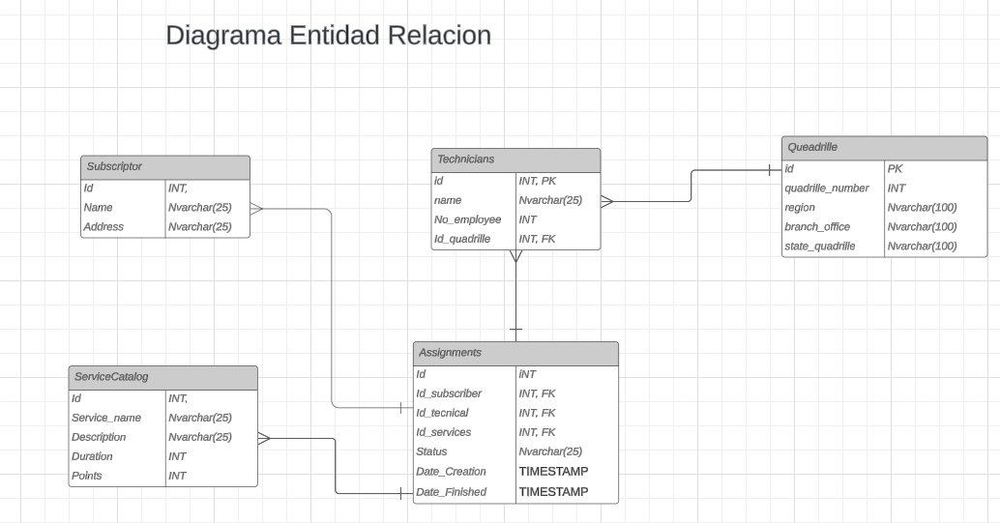

### Equipo 3 MEGAWINNERS

## Descripción de la Problemática

En la empresa, existen diferentes procesos de pago dependiendo de las áreas, siendo uno de los más relevantes el proceso de pago de puntos en el área técnica. Este pago se realiza mensualmente (cada quince días) y varía según el nivel de dificultad de cada tarea. Por ejemplo:

- **Instalación de acomida**: 5 puntos
- **Instalación de equipo**: 2 puntos

La cantidad de puntos acumulada por cada técnico se compara con una tabla de bonos:

| Rango de Puntos | Importe |
|------------------|---------|
| 0 a 80           | 0 pesos |
| 81 a 150         | 300 pesos |
| 151 a 210        | 500 pesos |
| 211 en adelante  | 650 pesos |

### Ejemplo de Cálculo

Si un técnico realiza 15 servicios de instalación de acomida y 12 de instalación de equipos, acumula:

- **Servicio de instalación**: 15 servicios * 5 puntos = 75 puntos
- **Instalación de equipos**: 12 instalaciones * 2 puntos = 24 puntos

**Total de puntos**: 75 + 24 = 99 puntos, lo que le correspondería un bono de **300 pesos**.

Para facilitar la consulta de bonos, es necesario generar reportes detallados que incluyan información sobre cada orden, como tipo de trabajo, puntos, fecha, importe, entre otros.

Por lo tanto, se requiere desarrollar un sistema automatizado que visualice los puntos generados y el pago correspondiente para cada técnico, accesible en cualquier momento.

## Requerimientos Técnicos

### Frontend

- **Angular**: v17

### Backend

- **.NET**: v8.0
- **Entity Framework Core**: v8.0.7
- **Entity Framework Core.SqlServer**: v8.0.7
- **Microsoft.EntityFrameworkCore.Tools**: v8.0.7
  
Puedes añadir estos paquetes mediante el comando:
```bash
dotnet add package [package name]
```
Si utilizas Visual Studio, puedes añadirlos usando el NuGet Package Manager.

- Base de Datos SQL Server: v2019

## Objetivos

### General

Desarrollar un reporte automatizado para el pago de puntos que incluya:
- Trabajo realizado
- Puntos generados
- Suscriptor
- Fecha
- Total de puntos obtenidos
- Importe del bono a pagar

### Específicos

- Diseñar una base de datos adecuada para el proyecto.
- Crear una interfaz de usuario atractiva e intuitiva que permita filtrar por técnico.
- Desarrollar y consumir una API REST con .NET de manera eficiente.

## Alcance del proyecto

Este proyecto consiste en la creación de una plataforma que permita a los usuarios:
- Consultar la cantidad de puntos y el bono a pagar de cada técnico.
- Generar reportes detallados que especifiquen:
  * Trabajo realizado
  * Puntos generados
  * Suscriptor
  * Fecha
  * Total de puntos obtenidos
  * Importe del bono a pagar
- Filtrar datos según criterios específicos, incluyendo la visualización de tareas completadas.

*** Excepciones
- No se incluye en el alcance del proyecto la creación de nuevas órdenes o la actualización de puntos a medida que se añaden nuevas órdenes.

## Descripción de la solución
La solución propuesta consiste en una plataforma que permita consultar y visualizar rápidamente, a través de reportes, la cantidad de puntos generados y el monto a otorgar a cada técnico, detallando los trabajos realizados. La información se presentará en formato de tabla con los siguientes campos:

- Trabajo realizado
- Puntos generados
- Suscriptor
- Fecha
- Total de puntos obtenidos
- Importe del bono a pagar

## ¿Cómo utilizar este repositorio?

1. **Obtener la URL del Repositorio**: Haz clic en el botón de "Code" y copia la URL del repositorio.
   
2. **Clonar el Repositorio**: Abre la terminal y ejecuta el comando:
   ```bash
   git clone <URL_DEL_REPOSITORIO>
3. Crear la Base de Datos: En SQL Server, crea una base de datos e incluye las tablas necesarias (consulta el archivo SQLQueryHackaton.sql).
4. Configurar la Conexión: En el archivo appsettings.json, añade tu cadena de conexión de la siguiente manera, reemplazando los valores necesarios:
   
` "ConnectionStrings": {
    "DefaultConnection": "Data Source=your_server_name;Initial Catalog=your_database_name;Encrypt=False;Persist Security Info=True;User ID=your_server_user_name;Password=your_sqlserver_password;"
  } `

5. Instalar Dependencias: Restaura las dependencias con:

 `dotnet restore`

6. Compilar el Proyecto: Luego, compila el proyecto con:

 `dotnet build`

7. Ejecutar el Proyecto: Ejecuta el proyecto con:

 `dotnet run`
8. Ejecutar Migraciones: Si es necesario, ejecuta migraciones para actualizar tu base de datos.
*** En el caso de dependencias necesarias, se pueden instalar de la siguiente manera Estos pueden ser añadidos  mediante los comandos `dotnet add package [package name]` o si estas utilizando Visual Studio puedee añadirlos usando `Nuget package manager`.

9. Instalar Dependencias del Frontend: En la raíz del proyecto, ejecuta:

`npm install`

10. Iniciar el Frontend: Luego, ejecuta:

`ng serve` 
Y espera a que se abra en tu navegador.

## Diagrama de la base de datos
 - Diagrama normalizado de la base de datos
 

 ## Importancia de las Herramientas Utilizadas

### Frontend: Angular
Angular es un framework poderoso que permite desarrollar aplicaciones web de una sola página (SPA) de manera eficiente. Su arquitectura basada en componentes facilita la organización del código, mejorando la escalabilidad y el mantenimiento del proyecto. Además, Angular proporciona una rica experiencia de usuario a través de su capacidad para crear interfaces interactivas y dinámicas.

### Backend: .NET
.NET es una plataforma robusta para el desarrollo de aplicaciones backend, que ofrece un rendimiento excepcional y una amplia gama de bibliotecas para facilitar el desarrollo. Utilizar .NET asegura que la API sea rápida, segura y fácil de mantener, lo que es esencial para la generación y consulta de reportes en tiempo real.

### Entity Framework Core
Entity Framework Core simplifica la interacción con la base de datos al proporcionar un enfoque orientado a objetos. Permite realizar consultas y manipulación de datos de manera más intuitiva, lo que acelera el desarrollo y reduce el riesgo de errores.

### SQL Server
SQL Server es un sistema de gestión de bases de datos confiable y escalable que garantiza la integridad y seguridad de los datos. Su integración con .NET facilita la creación de soluciones completas que requieren una gestión eficiente de datos.

## Futuras Mejoras
- **Integración de API Externas**: Explorar la posibilidad de integrar API de terceros para enriquecer los datos disponibles y mejorar el análisis de rendimiento.
- **Módulo de Feedback para Técnicos**: Implementar un sistema que permita a los técnicos dejar comentarios sobre las tareas realizadas, fomentando una mejora continua en los procesos.
- **Optimización de la Interfaz de Usuario**: Recoger retroalimentación de los usuarios para mejorar la experiencia de uso, haciendo la interfaz más intuitiva y atractiva.
- **Análisis de Datos**: Desarrollar funcionalidades de análisis que permitan a los administradores visualizar tendencias en el rendimiento de los técnicos a lo largo del tiempo.
- **Escalabilidad**: Preparar la infraestructura del sistema para manejar un mayor volumen de datos y usuarios conforme la empresa crezca.


