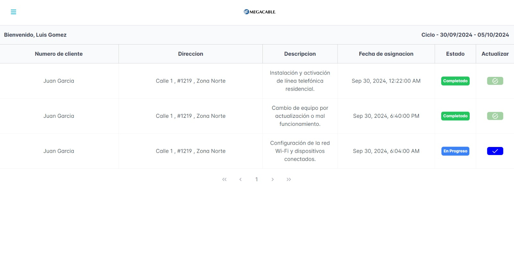
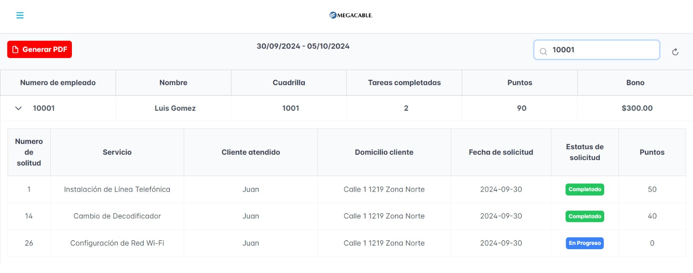
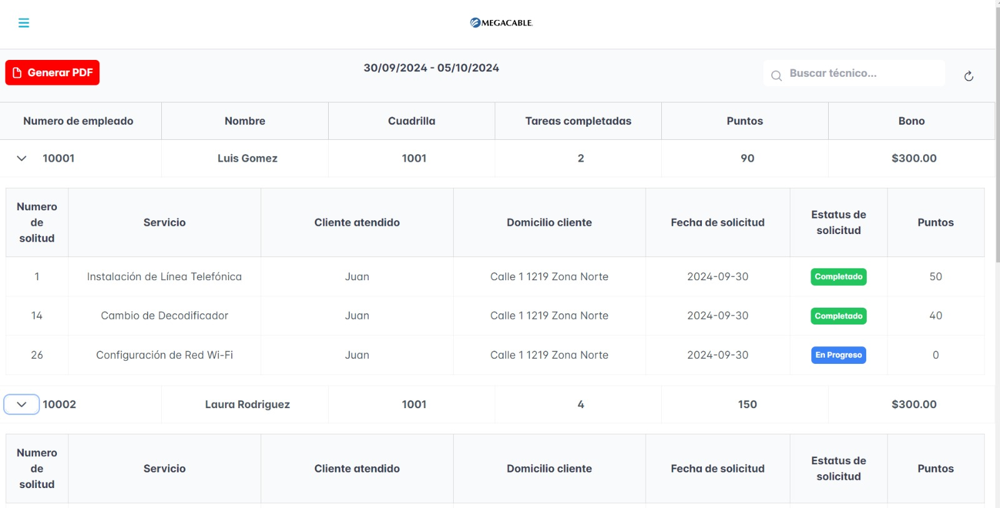
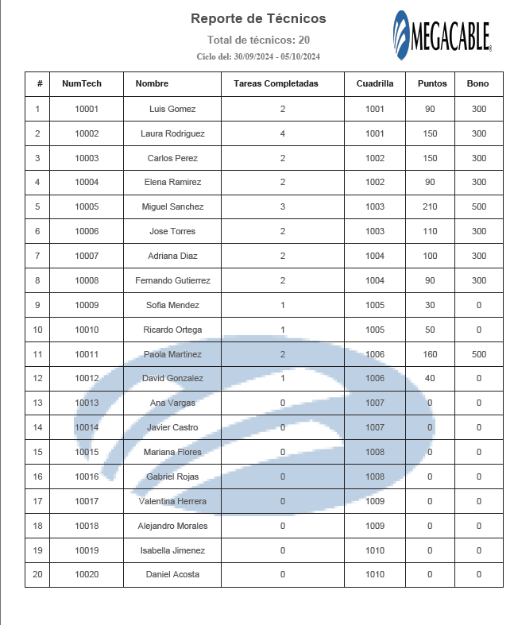

# Sistema de Reportes de Empleados -----

## Resumen del Proyecto
Este proyecto es un sistema de gestión de reportes para un acceso administrativo que permite visualizar registros de empleados, incluyendo datos de su cuadrilla, tareas asignadas y los puntos obtenidos en cada tarea, lo cual influye en su bono. Los administradores pueden filtrar reportes por diferentes criterios y generar PDFs de los reportes para su uso. Este sistema busca optimizar la gestión del rendimiento de los empleados y facilitar la toma de decisiones basada en datos.

## Características
- **Visualización de Datos**: Interfaz intuitiva para consultar información detallada de empleados y sus tareas.
- **Filtros Avanzados**: Posibilidad de filtrar por número de empleado.
- **Generación de Reportes en PDF**: Exporta reportes para su impresión o envío por correo electrónico.
- **Autenticación y Autorización**: Control de acceso para diferentes niveles de usuario.

## Tecnologías Utilizadas
- **Angular 18**: Para el desarrollo del frontend, proporcionando una experiencia de usuario interactiva y dinámica.
- **Tailwind CSS**: Utilizado para el diseño y la estilización de la aplicación, permitiendo un desarrollo rápido y un estilo moderno.
- **PrimeNG**: Librería de componentes UI que facilita la creación de interfaces atractivas y funcionales.

## Requerimientos Técnicos
- Node.js (versión 14 o superior)
- Angular CLI (versión 18)
- Un navegador moderno (Chrome, Firefox, etc.)

## Instalación
1. Clona el repositorio:
   ```bash
   git clone <URL_DEL_REPOSITORIO>
   cd <NOMBRE_DEL_REPOSITORIO>

   npm install (Instala las dependencias)
   npm start (Inicia la aplicación) La aplicación estará disponible en http://localhost:4200.

## Vistas del proyecto
- `Login `

- `Dashboard del técnico`

- `Dashboard del administrador`


- `Vista del archivo PDF generado`



## ¿Por qué se eligieron las herramientas?

- Angular 18: Elegido por su capacidad para construir aplicaciones web de una sola página (SPA) de manera eficiente, facilitando una experiencia de usuario fluida y rápida.
- Tailwind CSS: Permite un diseño responsivo y personalizable sin la necesidad de salir del flujo de trabajo, optimizando el tiempo de desarrollo.
- PrimeNG: Proporciona una amplia gama de componentes UI listos para usar, lo que acelera el desarrollo y mejora la consistencia de la interfaz.

## Futuras Mejoras
- Integración con API Externas: Posibilidad de integrar datos de otras aplicaciones para un análisis más completo.
- Módulo de Feedback: Implementar un sistema de retroalimentación para empleados que les permita evaluar sus tareas y proporcionar comentarios.
- Optimización de Rendimiento: Continuar mejorando el rendimiento de la aplicación, asegurando tiempos de carga rápidos y una experiencia de usuario óptima.


